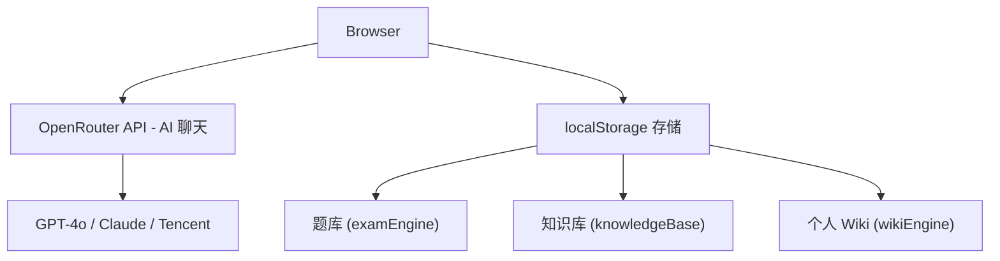

# AI Study 技术文档

## 架构概览

纯静态 Next.js 应用（`output: 'export'`），使用 OpenRouter API 完成 AI 聊天功能，localStorage 存储用户数据。



## 技术栈

| 技术 | 版本 | 用途 |
|------|------|------|
| **Next.js** | 16.2.9 | 静态导出 React 框架 |
| **React** | 19.2.4 | UI 渲染 |
| **TypeScript** | 5.x | 类型安全 |
| **Tailwind CSS** | 4.x | 样式 |
| **Puter.js** | v2 | 认证 / AI 聊天 / KV 存储 |
| **JSZip** | 3.10.1 | PPTX 文件解析 |
| **lucide-react** | — | 图标 |
| **react-markdown** | — | Markdown 渲染 |
| **remark-gfm/math** + **rehype-katex** | — | LaTeX 公式渲染 |
| **mermaid** | — | 图表渲染 |

## 数据流

### 认证流程
```
页面加载 → 检查 localStorage 用户信息 → 已登录: 加载本地数据 → 未登录: LoginScreen
登录后: 从 localStorage 拉取对话记录 + 额度数据 → 显示登录积分弹窗 (5秒自动消失)
```

### AI 聊天流程
```
用户输入消息 → 自动创建对话
→ 如有图片: 先用 tencent/hy3-preview 识别图片内容 (Vision Model)
→ 检查额度 → 不足则弹出 Upgrade 升级界面
→ 模型选择: Auto(默认) → 根据付费等级自动选择 / 付费用户可选 Balanced/Deep/Extreme
→ Extreme 模式: 多模型交叉验证 (GPT-4o + Claude 各自回答 → 合并结果)
→ OpenRouter API stream → 流式更新 UI
→ 后台: tencent/hy3-preview 生成对话标题 (最大6词, 根据输入语言)
→ 数据自动保存到 localStorage (2秒防抖)
```

### 数据同步流程
```
登录成功 → loadFromBackend(userId) → localStorage 拉取对话+额度
对话变更 → debounced persist (2秒) → saveToBackend(userId) → localStorage 写入
```

## 核心模块

### 1. 登录 + 额度系统

| 模块 | 文件 |
|------|------|
| 登录 UI | `components/LoginScreen.tsx` |
| OpenAI (OpenRouter) | `lib/api.ts` |
| 额度管理 | `lib/credits.ts` |
| 云端同步 | `lib/backend.ts` |

**额度规则**：
- 新用户 50 积分，每 3 小时自动补充
- 消耗: Solver 20, Visualizer 15, Chat 10
- 额度不足时自动弹出 Upgrade 升级界面
- 登录后弹窗显示当前积分和套餐等级 (5秒自动消失)
- 侧边栏和输入栏均有积分显示 + Upgrade 按钮
- **付费模型 (Balanced/Deep/Extreme)** 需要付费套餐才能使用，点击时弹出 Upgrade

### 2. 三模式 + 强度选择

| 模式 | ID | 用途 | 消耗 |
|------|----|------|------|
| Solver | `solver` | 解题 | 20分 |
| Visualizer | `visualizer` | 生成 Mermaid 图表 | 15分 |
| Chat | `chat` | 自由问答 | 10分 |

模式切换只保留在 Header 中央切换按钮，左侧侧边栏不再有模式按钮。

### 3. 强度选择器 (原"难度选择器")

| 强度 | 模型 | 付费 | 说明 |
|------|------|------|------|
| Auto 🔄 | `tencent/hy3-preview` | 免费 | 默认，根据套餐自动选择 |
| Light 🌱 | `openai/gpt-4o-mini` | 免费 | 轻量快速 |
| Balanced ⚖️ | `anthropic/claude-sonnet-4-20250514` | 付费 | 平衡模式 |
| Deep 🔬 | `openai/gpt-4o` | 付费 | 深入分析 |
| Extreme ⚡ | 多模型交叉验证 | 付费 | GPT-4o + Claude 分别回答 → 合并结果 |

**UI**: 可拖动的滑块组件，位于聊天输入框上方。点击展开详细选择面板，付费选项显示 `PAID` 标签。

组件: `components/IntensitySelector.tsx`

### 4. 付费方案

| 方案 | 价格 | 额度/3h | 功能 |
|------|------|---------|------|
| Plus | $9.99/月 | 200 | Balanced 模型访问 |
| Pro | $19.99/月 | 500 | 全模型 (Deep + Extreme) + 多模型交叉验证 |
| Pro+ | $39.99/月 | 无限 | 全功能 + SLA |

**升级界面**: `components/UpgradeModal.tsx` — 精美弹窗，3 个套餐卡片，功能对比列表，Popular 标签，玻璃模糊背景。

升级入口:
- 侧边栏 Upgrade 按钮
- 输入栏积分点击
- 额度耗尽时自动弹出
- 点击付费强度时弹出

### 5. 图片识别

使用 `tencent/hy3-preview` (VISION_MODEL) 进行图片分析。发送消息前，如有图片附件，先用该模型提取图片中的文本/公式/图表内容，然后作为上下文发送给主 AI 模型。

### 6. 题库 + Flashcard 闪卡

| 功能 | 文件 |
|------|------|
| 题库 CRUD + 搜索 | `components/QuestionBank.tsx` |
| 题库引擎 | `lib/examEngine.ts` |
| 闪卡 | `components/FlashCard.tsx` |

- 保存 AI 问答对到题库
- AI 自动预测课程/学科/TAG (`lib/questionAnalyzer.ts`)
- 闪卡翻转复习 (键盘快捷键: ← → Space)
- 搜索过滤: 学科/TAG/时间/难度

### 7. 知识库

| 功能 | 文件 |
|------|------|
| 知识库页面 + 文件上传 | `components/KnowledgeBasePage.tsx` |
| 知识库引擎 | `lib/knowledgeBase.ts` |
| 文件解析器 | `lib/fileParser.ts` |

- 支持文件类型: HTML, PPTX, PPT, DOC, DOCX, PDF, TXT, MD
- HTML 文件上传后自动解析提取定理/定义/公式
- 支持 PPTX 文件 (JSZip 提取文本)
- 提取结果自动导入 Wiki

### 8. 个人 Wiki + 节点图

| 功能 | 文件 |
|------|------|
| Wiki CRUD + 图形/列表/编辑 | `components/PersonalWiki.tsx` |
| 节点图可视化 | `components/WikiNodeGraph.tsx` |
| Wiki 引擎 | `lib/wikiEngine.ts` |

- 5 种分类: theorem(蓝), definition(绿), formula(紫), note(黄), concept(灰)
- Obsidian 风格节点图: SVG 力导向布局, 拖拽, 分类颜色编码
- 自动关联: 基于共享标签自动链接条目
- 搜索 + 分类过滤

### 9. 模拟考

| 功能 | 文件 |
|------|------|
| 模拟考 | `components/MockExam.tsx` |
| 考试引擎 | `lib/examEngine.ts` |

- 配置: 强度/题量/时长/学科
- 计时考试界面
- 自动评分 + 错题回顾 + 闪卡复习

### 10. 举一反三 + 检索系统

| 功能 | 文件 |
|------|------|
| 类似题目生成 | `components/SimilarQuestions.tsx` |
| AI 分析 | `lib/questionAnalyzer.ts` |
| 搜索面板 | `components/SearchPanel.tsx` |

- AI 自动生成 3 道类似题目
- 全文搜索 + 多维度过滤: 学科/TAG/难度/时间范围

### 11. 消息气泡 (MessageBubble)

`components/MessageBubble.tsx`
- Markdown + LaTeX + Mermaid 渲染
- Thinking 折叠区域 (reasoning 字段)
- 强度/模型标签显示
- 保存到题库按钮
- 举一反三按钮

### 12. 站点仪表盘

`components/AdminStats.tsx`
- 查看用户数、存储键数
- 图形化卡片界面
- 刷新按钮

## 项目文件结构

```
E:\ai-study-puter
├── next.config.ts               # output: 'export' 静态导出
├── deploy-fixed.js              # Puter.js SDK 批量部署脚本
├── deploy.js                    # (旧) CLI 部署脚本
├── deploy-api.js                # (备用) REST API 直连部署
├── src/
│   ├── app/
│   │   ├── layout.tsx           # 根布局 + Puter.js script
│   │   ├── page.tsx             # 登录门控 → AppShell
│   │   └── globals.css          # 全局样式 + CSS 变量
│   ├── components/
│   │   ├── AppShell.tsx         # 主应用 (Puter AI + 额度 + 云端同步 + 所有功能集成)
│   │   ├── Sidebar.tsx          # 侧边栏 (对话列表 + Upgrade + 所有工具入口)
│   │   ├── MessageBubble.tsx    # 消息气泡 (Markdown+LaTeX+Mermaid+Thinking)
│   │   ├── LoginScreen.tsx      # 登录界面
│   │   ├── UpgradeModal.tsx     # 升级弹窗 (Plus/Pro/Pro+ 精美卡片)
│   │   ├── IntensitySelector.tsx # 强度选择器 (可拖动滑块, auto/extreme)
│   │   ├── AdminStats.tsx       # 站点仪表盘 (用户数/存储键)
│   │   ├── QuestionBank.tsx     # 题库
│   │   ├── FlashCard.tsx        # 闪卡反转复习
│   │   ├── SimilarQuestions.tsx # 举一反三
│   │   ├── KnowledgeBasePage.tsx# 知识库
│   │   ├── PersonalWiki.tsx     # 个人 Wiki
│   │   ├── WikiNodeGraph.tsx    # Obsidian 风格节点图
│   │   ├── MockExam.tsx         # 模拟考
│   │   ├── SearchPanel.tsx      # 检索系统
│   │   ├── FileUploader.tsx     # 文件上传
│   │   ├── ImageUploader.tsx    # 图片上传/粘贴
│   │   ├── MermaidRenderer.tsx  # Mermaid 图表渲染
│   │   └── Providers.tsx        # ThemeProvider
│   └── lib/
│       ├── api.ts                # OpenRouter API 封装
│       ├── backend.ts           # localStorage 存储 + 站点统计
│       ├── credits.ts           # 额度系统
│       ├── examEngine.ts        # 题库 + 模拟考引擎
│       ├── knowledgeBase.ts     # 知识库引擎
│       ├── wikiEngine.ts        # 个人 Wiki 引擎
│       ├── fileParser.ts        # 文件解析
│       ├── questionAnalyzer.ts  # AI 课程预测
│       └── prompts.ts           # 3 种模式 System Prompt
```

## 启动方式

```bash
cd E:\ai-study-puter
npm install
npm run dev       # http://localhost:3000
npm run build     # 输出到 out/ 目录
```

## 构建部署

```bash
npm run build
```

## 数据存储

所有数据存储在浏览器 localStorage 中。

### v1.2.0 (2026-06-24)
- **移除 Puter 依赖**: 改用 OpenRouter API，localStorage 存储
- **新登录系统**: 用户名输入登录

### v1.1.0 (2026-06-24)
- **强度选择器**: 原"难度选择器"重命名为"强度选择器"，改为可拖动滑块UI，位于聊天框上方
- **Auto 默认强度**: 初始为 Auto 模式，使用 `tencent/hy3-preview`，免费用户可用 Auto + Light
- **Extreme 极速模式**: 多模型交叉验证 (GPT-4o + Claude 独立回答 → 合并结果)
- **付费锁定**: Balanced/Deep/Extreme 强度需要付费套餐，点击弹出升级界面
- **升级界面**: 全新 `UpgradeModal.tsx` 精美弹窗，3 套餐卡片对比，Popular 标签，玻璃背景
- **积分耗尽自动升级**: 额度不足时自动弹出升级界面
- **localStorage 存储**: 对话和额度数据存储在浏览器本地
- **登录积分弹窗**: 登录后显示积分和套餐等级，5 秒自动消失，额度为 0 时显示升级链接
- **侧边栏简化**: 移除左侧模式切换按钮，仅保留 Header 中央模式切换
- **图片识别**: `tencent/hy3-preview` 作为 Vision Model，发送前自动识别图片内容
- **标题生成优化**: 首次发送消息后 `tencent/hy3-preview` 自动生成对话标题 (6词内)
- **站点仪表盘**: `AdminStats.tsx` 图形化查看用户数和存储键
- **数据持久化**: localStorage + Puter KV 双备份，跨设备同步

### v1.0.1 (2026-06-24)
- 难度选择器从 header 移动到聊天框上方
- 侧边栏模式按钮改为只切换模式，不再自动创建对话
- 对话创建逻辑: 首次发送消息时自动创建，标题由 `tencent/hy3-preview` 自动生成
- 登录后弹窗显示额度信息
- 侧边栏增加 Upgrade 按钮
- 新增 `lib/api.ts` (OpenRouter API 封装)

### v1.0.0 (2026-06-23)
- OpenRouter API 集成: AI 聊天
- 登录系统: 用户名登录
- 额度系统: 50积分/3小时
- 三级难度选择: Easy/Medium/Hard
- 付费方案 UI
- 知识库/个人 Wiki/题库/模拟考/举一反三/检索